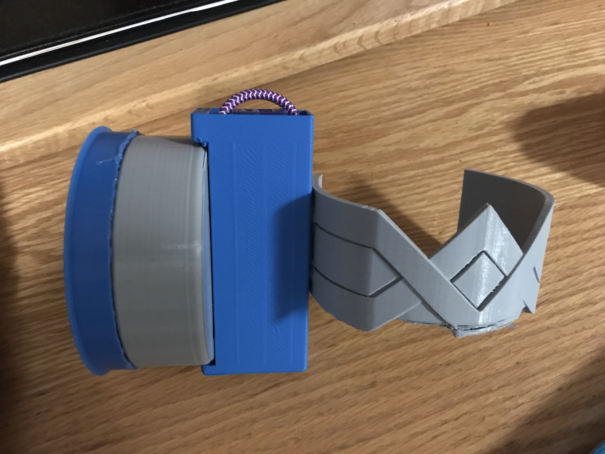

# Final Project - Physical Computing and the Internet of Things

This is a template for your final project documentation.  Please replace <content like this> with your own.  For help with the syntax of Github markdown, visit: [Mastering Markdown](https://guides.github.com/features/mastering-markdown/)

*Name:*  Shreya Shankar

*Date:* December 13, 2017

## Project: Theymiscira 

This project is a womens safety wearable device, designed to offer women protection while they are out for a run by themselves. The device works as an armband that mimics an armband one would use to hold a phone or water bottle while out for a run. This device operates in a simple manner, by sending a text message to a pre-registered phone number if a force is detected on the armband. 

### Detailed Project Description

This device operates in a simple manner, by sending a text message to a pre-registered phone number if it detects a force over a certain amount. The force sensitive resistor used while creating this device measures force in terms of resistance; a higher resistance equates to a lower amount of force applied. Baed on values of a 10 KOhm resistor, a resistance measurement of 250 Ohms equates to a force measurement of 100 Newtons, or 22 pounds. For the purpose of the demo, the force that was required for the sensor to send a signal was on the lower side - 200 Ohms. If used in the real world, an average 30-year-old man has a crushing grip strength of 80 pounds for his dominant hand. Therefore, the resistance value required to be measured would be much lower (around 100 Ohms). 

Using this device is simple, a woman simply has to put the armband on before she goes out for a run, and the continue with her regular routine. This device will only act if force is detected. There is no extra effort required on the woman's part, apart from the pre-registration of her "emergency" number. 

The idea for this device came from personal experiences as well as other horrifying stories that have happened to women as they went out for a run themselves. This device is responding to the growing problem of womens safety across the globe, and this device was created to enable women to be able to lead healthy lives while worrying less about their safety (something I believe they shouldn't have to worry about at all). Personally, there have been many times when I have wanted to go out for a run in the dark but have been too scared to do so or have been told by others that it isn't a good idea. Even in Singapore, where the crime rate is incredibly low (less than one percent), I have been told to not go for a run by myself after dark because womens safety is still at risk in a country as safe as Singapore. 

The issue of womens safety is far from resolved and requires a lot more work and education, but until the world is able to get to that point where women no longer fear their safety, devices like these will be necessary to allow women to lead their lives in the same way that men do without any fear. 

### Technical Description

To build this device, I used a Force Sensitive Resistor and connected it to a wearable photon shield. The wearable photon shield was connected to a mini-arduino which was powered by a USB pack. The hardware interacts with the software through IFTTT, which monitors the force variable and only sends a signal if that variable is detected to be over a certain amount. My goal was to make this device as compact as possible, as a clunky device will provide inconveniences if being used while someone is running. To ensure that the device stays intact through the shocks of running, the wires are soldered together and are wrapped with heat-shrink tubing. 

#### Hardware Wiring Diagram


** Note that I wasn't able to find a Fritzing diagram of the Sparkfun Photon Wearable Shield, so I used the regular Sparkfun Protoshield instead. The wiring for this is simple, a 10 KOhm resistor is wired to the Force Sensitive Resistor which is connected to a photon wearable shield (the Protoshield in the diagram). 

#### Code

```int fsrPin = 0;     // the FSR and 10K pulldown are connected to a0
int fsrReading;     // the analog reading from the FSR resistor divider
 
void setup(void) {

  Serial.begin(9600);   
  Particle.variable("Force", fsrResistance);
  // Spark.variable("getForce", &fsrPin, INT);

}
 
void loop(void) {
  fsrReading = analogRead(fsrPin);  
 
  Serial.print("Analog reading = ");
  Serial.print(fsrReading);     // the raw analog reading
  
fsrVoltage = map(fsrReading, 0, 1023, 0, 5000);
  Serial.print("Voltage reading in mV = ");
  Serial.println(fsrVoltage);  
 
    // The voltage = Vcc * R / (R + FSR) where R = 10K and Vcc = 5V
    // so FSR = ((Vcc - V) * R) / V       
    fsrResistance = 5000 - fsrVoltage;     // fsrVoltage is in millivolts so 5V = 5000mV
    fsrResistance *= 10000;                // 10K resistor
    fsrResistance /= fsrVoltage;
    Serial.print("FSR resistance in ohms = ");
    Serial.println(fsrResistance)
 
  delay(1000);
} 
```
As I have never taken a coding class before this one (besides in Matlab), my software skills were on the weaker side. Therefore, I went with a simple code to make sure that the functionality worked. Using IFTTT, I was able to communicate with the photon and monitor the force variable (using "fsrResistance" as seen in the code above). The code takes the raw analog reading and converts it to voltage, and using voltage division converts the voltage reading to resistance. IFTTT tracks the "fsrResistance" variable and is triggered if the resistance value is equal to 500 (for the sake of the demo). In reality, it should trigger if the resistance is less than or equal to around 100 Ohms, as mentioned in the introduction. I was able to understand how a FSR works and what measurements it takes, and with the help of online tutorials and resources was able to understand how to convert the analog reading to resistance that can be monitored and that makes sense. 

 Link to code: [my_code.ino](code/my_code.ino)  


### Design / Form

For the design of this device, I was inspired by Wonder Woman and the values she stands for and projects. To me and to many others, she is seen as a symbol of feminism and as a strong, powerful woman. I came to this decision after thinking about the feeling that I wanted my product to create. Wonder Woman symbolizes the power of women, as she comes from a race of all women warriors, and fights along side great men warriors like Superman and all. I landed on the conclusion that I wanted women to feel empowered while using this device, and there was no better way of instilling a feeling of empowerment than wearing the symbol of the powerful female superhero. Every woman wearing the band will feel like she's joining an army of women and will feel the support of the army behind her as she goes out for her run. The armband is in the shape of Wonder Woman's famous symbol, designed in Fusion 360 and 3D Printed.

For the rest of this device, I wanted it to be as compact as possible so I used the photon shield and a USB device. The entire device is interconnected through the inside and doesn't require any effort from the user to be put in or taken out. The idea is that the user would buy the device as a whole, with the armband and enclosure and would only have to remove the cap of the USB holder to charge the device. Other than that, the device will remain in the enclosure and will not be visible to the user.



< include photos of your device >

### Evaluation / Reflection

< What is your own evaluation of your project?   What did you learn through this project?  What would you do differently in the future? >

I'm very happy with the direction I took this project in. Womens safety has been a big issue for me and I've been looking for ways that I can make an impact. It's incredible to me to see that even with not a lot of experience in the field of IoT, I can make a difference using the knowledge that I currently have. 

I'm very passionate about the intersection of design and technology and would like to pursue a career in product design. To me, it was very interesting to design this project while considering all the needs of the user and understanding the user base that I was targeting. I focused more on the design and on how this product would deliver the best possible experience, both for the runner and the person on the receiving end of the emergency text message. Through this class, I've learnt what considerations are necessary when designing for IoT devices, and how design plays a critical role when creating products that aren't bounded by the screen. The idea is to create an immersive experience for the user, through funtionality and design. 

In terms of the runner, it was important to create a product that would be inconspicuous but would also make the runner feel safe and empowered. I think I achieved that relatively well, with the armband and the idea of the wearable shield. I would ideally like to reduce the size of the battery to make it less clunky and potentially try and go from an armband to a bracelet, or a ring to add to the idea of making the product as invisible as possible. I learnt how important it is to apply the rules of digital product design to physical products, and how different edge cases must be considered when building physical products. In the case of the person receiving the text messages, I had to think about what information is necessary to be displayed. The message had to be direct and concise and allow for the receiver to take action quickly. The message currently being sent is simple, it has an SOS message and the runner's phone number. In the future, I would like to implement a GPS as well in order to have the receiver see where the runner is if additional help needs to be called. By implementing a GPS tracking unit in the wearable device, the burden of having to call for extra help will be taken off the runner and the receiver will be able to do so quickly with accurate information. 
